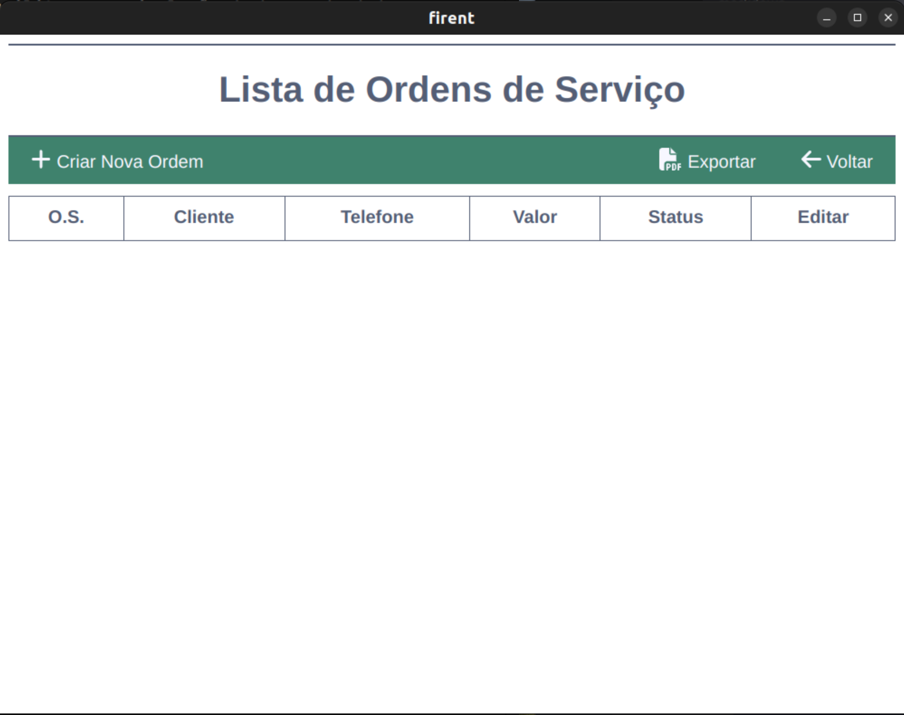

# Firent - Sistema de Gestão de Produtos para Locação  

## 📌 Introdução  
O **Firent** é um sistema desktop para gestão de produtos destinados à locação.

Esse sistema foi criado  com objetivo de atender uma demanda de uma empresa que já tem um ERP mas não possui essa funcionalidade. Como havia a necessidade de  evitar custos com hospedagem, a solução ideal  
foi desenvolver um aplicativo desktop, voltado principalmente para Windows.

Para atingir esse objetivo, foi escolhido o Electron que é um framework de código aberto que permite criar aplicações para desktop multiplataforma(Windows, macOS e Linux) usando tecnologias web, como HTML, CSS e JavaScript. 

Como o desempenho e o consumo de memória eram preocupações importantes, optou-se por um banco de dados leve e eficiente, resultando na escolha do SQLite. Para facilitar a manipulação do banco e familiaridade utilizou-se o Prisma ORM.

 O Next.js foi escolhido para o desenvolvimento do backend e frontend, pois além de ser baseado em React, ele permite a criação de uma API integrada dentro do próprio projeto, o que facilita a comunicação entre as diferentes partes do sistema. 

 ## 📌 Tecnologias Utilizadas  

| Tecnologia   | Descrição |
|-------------|-----------|
| **Electron**  | Framework para desenvolvimento de aplicativos desktop usando tecnologias web. |
| **Next.js**   | Framework React que permite criar aplicações web com backend integrado. |
| **React**     | Biblioteca JavaScript para construção de interfaces de usuário. |
| **SQLite**    | Banco de dados leve e eficiente, ideal para aplicações desktop. |
| **Prisma ORM** | ORM para facilitar a manipulação do banco de dados SQLite. |
| **Node.js**   | Runtime JavaScript para execução no lado do servidor. |

## ✨ Funcionalidades  
✅ **Cadastro de Produtos**  
- Adicione itens ao estoque informando nome, quantidade e status. 

✅ **Cadastro de Ordem de Serviço**  
- Registre ordens com nome do cliente, telefone, produtos e valor.

✅ **Relatórios e Exportação** 
- Geração de relatórios de produtos e ordens de serviço com opção de exportação em **PDF**.  

## 📷  Screenshots

  

  

## 📜 Licença
Este projeto está sob a licença MIT. Consulte o arquivo LICENSE para mais detalhes.

